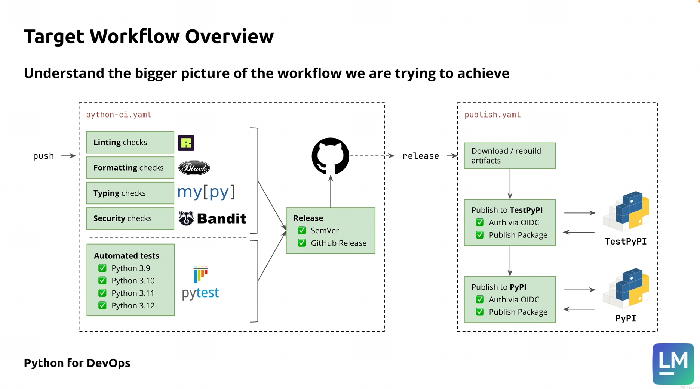

# Python for DevOps: CI/CD for Python project

This repo contains te code for CI/CD section of Python for DevOps course (https://www.udemy.com/course/python-devops)

## Plan of implementation

- [x] project (code files), see [implementation plan](./docs/implementation-plan.md)
- [x] Simple GHA workflow
- [x] Lining and format checks
- [x] Typing check
- [x] Security check
- [x] Test automation
- [x] Project build
- [] Publish to both TestPyPi and PyPi when a new release is published

---

## Target Workflow overview



---

## Project installation

From the project's root:
```bash
python -m venv .venv
source .venv/bin/activate
(.venv) which python
(.venv) pip install --upgrade pip

# install dependencies
(.venv) pip install -e .

# install dependencies including dev dependencies
(.venv) pip install -e ".[dev]"
```
> All futher commands are assumed to be executed in the project virtual environment

---

## Using CLI tool

```bash
# usage
check-urls <URL1> <URL2> ... [--timeout <seconds>] [--verbose]/[-v]

# example
check-urls http://localhost https://google.com https://httpbingo.org/status/404 --timeout=4 -v
```

---

## Tests and checks

### Manual commands

From the project's root:
```bash
black --check .
ruff check .
mypy src/
bandit -c pyproject.toml -r .
```

---

## Build

From the project's root:
```bash
python -m build
```
> Resulting `.whl` and `.tar.gz` files could be found in the `dist` folder.
---
